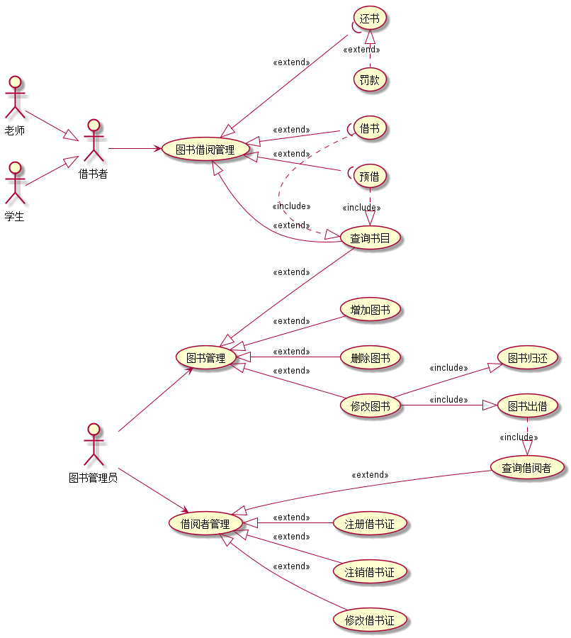
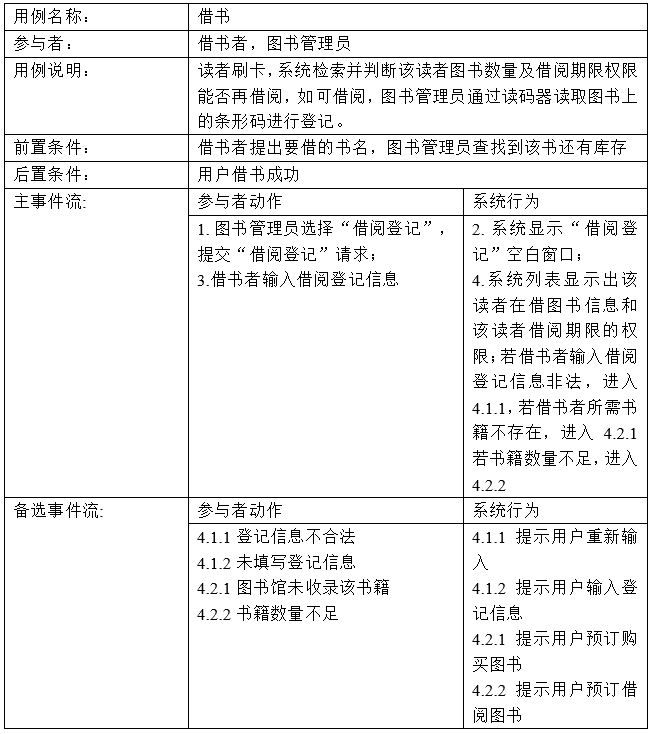
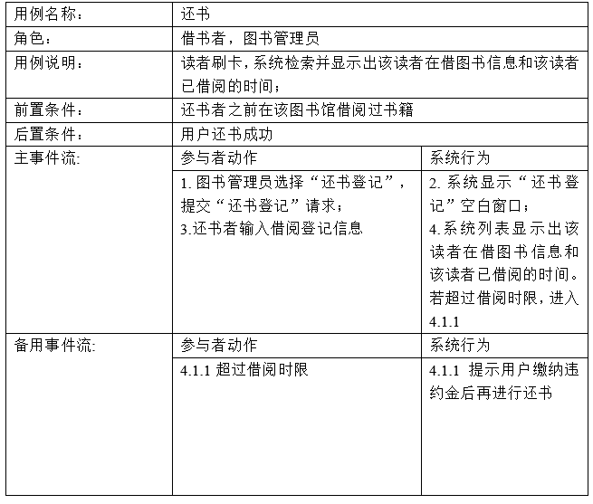
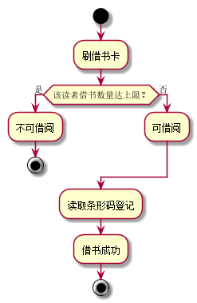
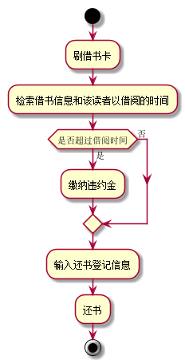

# 实验2：图书管理系统用例建模
|学号|班级|姓名|照片|
|:-------:|:-------------: | :----------:|:---:|
|201510414411|软件(本)15-4|刘一||

## 1. 图书管理系统的用例关系图

### 1.1 用例图PlantUML源码如下：

``` usecase
@startuml
left to right direction
:图书管理员: as admin
:借书者: as brow
:老师: as teacher
:学生: as student
teacher--|>brow
student--|>brow
admin-->(借阅者管理)
admin-->(图书管理)
(借阅者管理)<|--(注册借书证):<<extend>>
(借阅者管理)<|--(注销借书证):<<extend>>
(借阅者管理)<|--(修改借书证):<<extend>>
(借阅者管理)<|--(查询借阅者):<<extend>>

(图书管理)<|--(查询书目):<<extend>>
(图书管理)<|--(增加图书):<<extend>>
(图书管理)<|--(删除图书):<<extend>>
(图书管理)<|--(修改图书):<<extend>>
(修改图书)--|>(图书归还):<<include>>
(修改图书)--|>(图书出借):<<include>>
(图书出借).|>(查询借阅者):<<include>>
brow-->(图书借阅管理)
(图书借阅管理)<|--(查询书目):<<extend>>
(图书借阅管理)<|--((借书):<<extend>>
(图书借阅管理)<|--((还书):<<extend>>
(图书借阅管理)<|--((预借):<<extend>>
(还书)<|.(罚款):<<extend>>
(借书).|>(查询书目):<<include>>
(预借).|>(查询书目):<<include>>
@enduml
```


### 1.2. 用例图如下：



## 2. 参与者说明：

###     2.1 图书管理员

```
主要职责是：
	图书管理
		增加图书
		删除图书
		修改图书
			图书出借
			图书归还
		查询书目
	借阅者管理
		注册借书证
		注销借书证
		修改借书证
		查询借阅者
```
###     2.2 借书者
```
主要职责是：
	图书借阅管理
		查询书目
		预借
		借书
		还书
```
###     2.3 老师、学生
```
主要职责是：
	（具体的借书者）图书借阅管理
```

##     3. 用例规约表

###     3.1 “借书”用例



###     3.2 “还书”用例




**“借书”用例流程图源码如下：**
``` 
@startuml
start
:刷借书卡;
if (该读者借书数量达上限？) then (是)
:不可借阅;
stop
else(否)
:可借阅;
endif
:读取条形码登记;
:借书成功;
stop
@enduml
```

**“借书”用例流程图如下：**




**“还书”用例流程图源码如下：**
``` 
@startuml
start
:刷借书卡;
:检索借书信息和该读者以借阅的时间;
if (是否超过借阅时间) then (是)
:缴纳违约金;
else(否)
endif
:输入还书登记信息;
:还书;
stop
@enduml
```

**“还书”用例流程图如下：**



