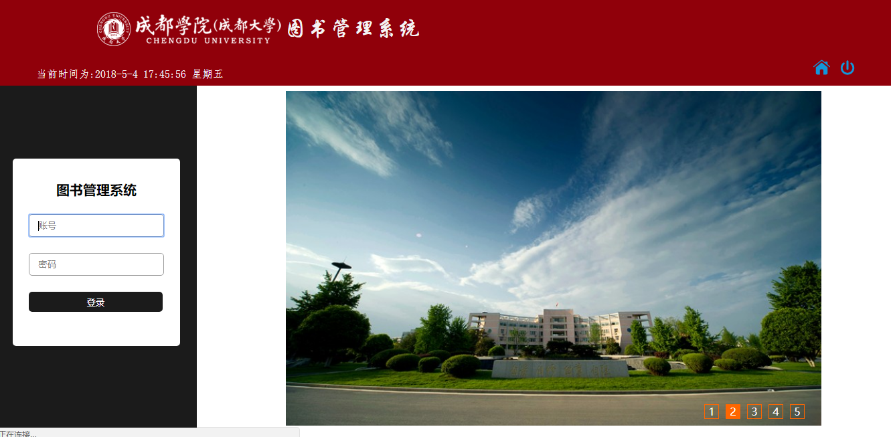
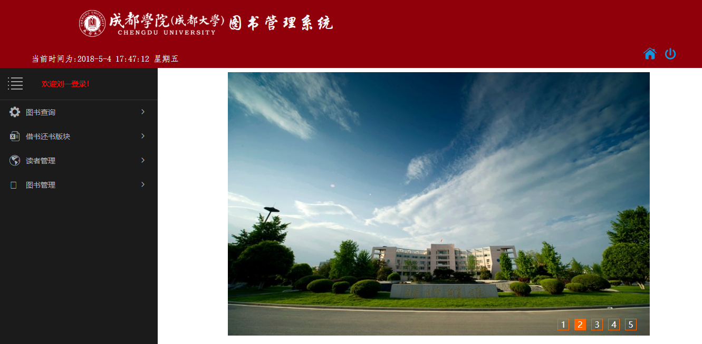
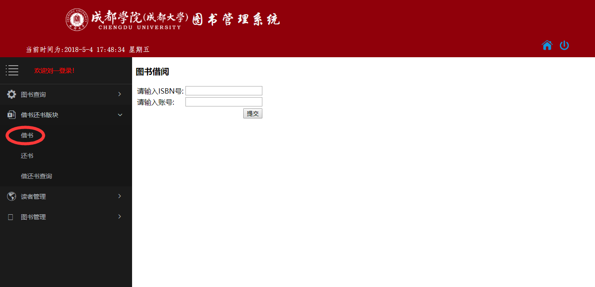
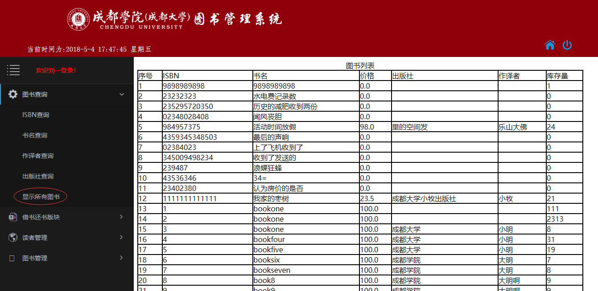
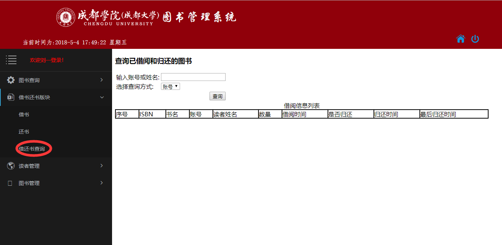
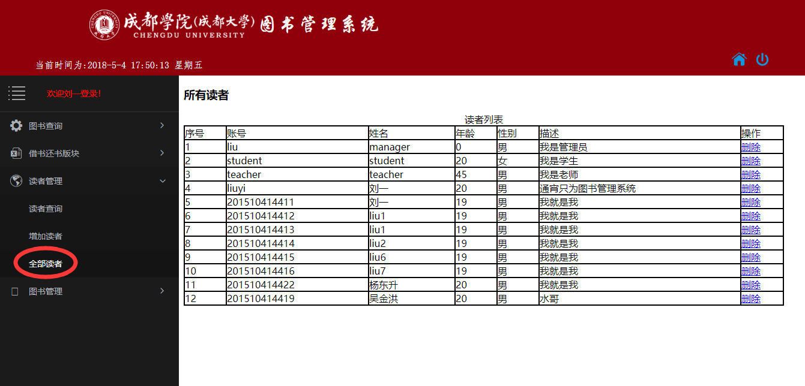
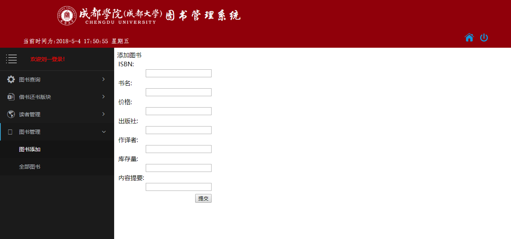
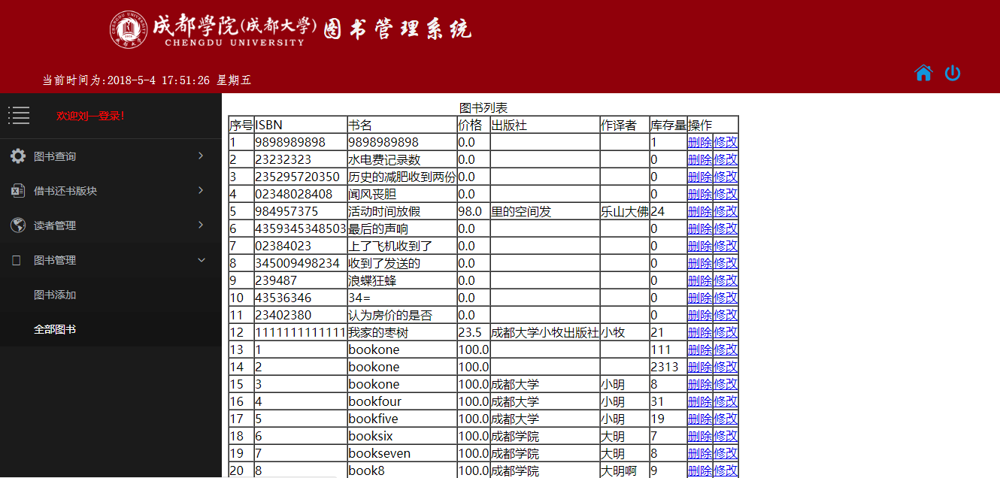

# 实验5：图书管理系统数据库设计与界面设计
|学号|班级|姓名|照片|
|:-------:|:-------------: | :----------:|:---:|
|201510414411|软件(本)15-4|刘一|[](my.png)|

## 1.数据库表设计

## 1.1. 图书表（book）
|字段|类型|长度|小数点|主键，外键|可以为空|
|:-------:|:-------:|:----:|-------------:|:------:|:----:|
|id|int|10|0|主键|no|
|ISBN|varchar|13|0|主键|no|
|name|varchar|255|0| |no|
|publisher|varchar|255|0| |yes|
|author|varchar|40|0| |yes|
|price|varchar|40|1| |yes|
|copucount|int|10|0| |yes|
|stock|int|10|0| |yes|
|description|varchar|255|0| |yes|
|photo|binary|255|0| |yes|

## 1.2. 用户信息表(user)
|字段|类型|长度|小数点|主键，外键|可以为空|
|:-------:|:-------:|:----:|-------------:|:------:|:----:|
|id|int|10|0|主键|no|
|account|varchar|30|0|主键|no|
|password|varchar|30|0| |yes|
|name|varchar|30|0| |yes|
|role|int|2|0| |yes|
|age|int|3|0| |yes|
|gender|varchar|1|0| |yes|
|signature|vachar|255|0| |yes|

## 1.3.借书还书表(lend)
|字段|类型|长度|小数点|主键，外键|可以为空|
|:-------:|:-------:|:----:|-------------:|:------:|:----:|
|id|int|10|0|主键|no|
|ISBN|varchar|13|0| |no|
|book_name|varchar|30|0| |yes|
|account|varchar|30|0| |no|
|reader_name|varchar|30|0| |yes|
|count|int|10|0| |no|
|lend_data|datetime|0|0| |yes|
|isreturn|tinyint|1|0| |no|
|return_date|detetime|0|0| |yes|

***

## 2. 界面设计
## 2.1. 登录界面设计

登陆后

## 2.2. 图书查询设计



## 2.3. 借还书板块设计

## 2.4. 读者管理设计

## 2.5. 图书管理设计


- 用例图参见：借书用例
- 类图参见：借出图书类
- 顺序图参见：借出顺序图
- API接口如下：

1. 接口调用请求说明

- 功能：用于获取全部分类
- 支持格式:json/xml
- 请求地址：http://api.yi18.net/book/bookclass
- 请求示例:请求示例：http://api.yi18.net/book/search?keyword=资本论
- 请求方法：GET
- 请求参数： Allow

|参数名称|必填|说明|
|:-------:|:-------------: | :----------:|
|access_token|是|用于验证请求合法性的认证信息。 |
|method|是|固定为 “GET”|

- 返回实例：
```
{
       {  
       "resultcode":"200",  
       "reason":"Success",  
       "result":{  
       "data":[  
         {  
            "title":"资本论",  
            "catalog":"社会 哲学 文学 ",  
            "tags":"资本的定义，产生和发展过程 ",  
            "sub1":"《资本论》",  
            "sub2":"《资本论》作者是卡尔·马克思，译者中共中央马恩列斯著作编译局，首版出版于1867年9月14日的德国汉堡。全称《资本论·政治经济学批判》，是马克思主义的重要百科全书，同时也是马克思研究资本主义社会经济形态的巅峰之作。马克思在这部著作里，以唯物史观的基本思想为指导，通过深刻分析资本主义生产方式，揭示了资本主义社会发展的规律，这样就使唯物史观得到了科学验证和进一步的丰富发展",  
           "img":"http://api.yi18.net/book/bookclass/img/379cdafe13f92d62e99388182a6d08ec.jpg",  
            "reading":"8091人阅读",  
            "online":"京东商城:http://book.jd.com/20587462876.html 
            "bytime":"2018年4月28日"  
          }  
        ],  
       "totalNum":"9",  
       "pn":0,  
       "rn":"1"  
        }  
       }  
```
- 返回参数说明：
    
|参数名称|说明|
|:-------:|:-------------: |
|BookInfo|返回图书信息|
|PersonInfo|用户的个人信息|
|200|返回码|

