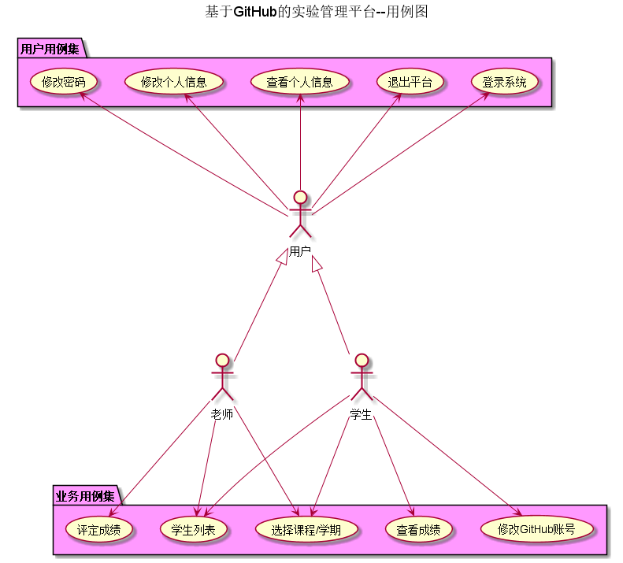
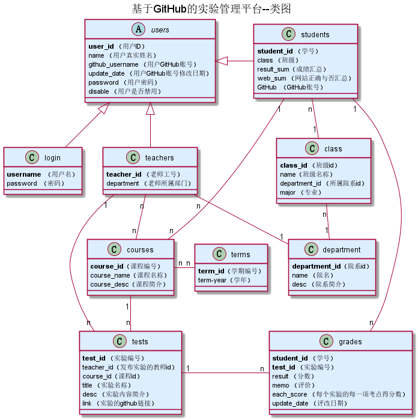

# 基于GitHub的实验管理平台的分析与设计
|    学号  |   班级    |    姓名  |   照片     |
|:--------:|:--------: | :----------: | :-------:|
|201510414411|软件(本)15-4|刘一 ||

## 1. 概述
- 基于GitHub的实验管理平台的作用是在线管理实验成绩的Web应用系统。学生和老师的实验内容均存放在GitHUB页面上。
- 学生的功能主要有：一是修改个人信息（GitHub账号），二是查询自己的实验成绩（每个实验详细得分点），三是学生在登录后，可以选择当前学期进行选课。
- 老师的功能主要有：一是批改每个学生的成绩，学生的实验成绩有多个得分项目组成。二是查看每个学生的成绩。
- 老师和学生都能通过本系统的链接方便地跳转到学生的每个GitHUB实验目录，以便批改实验或者查看实验情况。
- 实验成绩按数字分数计算，每项实验的满分为100分，最低为0分。最终实验分数由多个得分点组成。
- 最终系统自动计算每个学生的所有实验的平均分。
    
## 2. 系统总体结构

实验管理平台界面设计参见：https://liuyi6161.github.io/is_analysis/test6/UI/index.html
    
## 3. 用例图设计 [源码](src/Usercase.puml)

## 4. 类图设计 [源码](./src/class.puml)

## 5. 数据库设计 
- ### [参见详情](./dataBaseDesign.md)
     
## 6. 用例及界面详细设计
    
- ### [“学生列表”用例](./useCase/学生列表.md),[界面](https://liuyi6161.github.io/is_analysis/test6/UI/index.html)    
- ### [“登录”用例](./useCase/登录.md),[界面](https://liuyi6161.github.io/is_analysis/test6/UI/login.html)
- ### [“学生登录”用例](./useCase/学生登录.md),[界面](https://liuyi6161.github.io/is_analysis/test6/UI/login-student.html)
- ### [“选择学年/学期”用例](./useCase/选择学期年.md),[界面](https://liuyi6161.github.io/is_analysis/test6/UI/personalscore.html)
- ### [“个人成绩中心”用例](./useCase/查看成绩.md),[界面](https://liuyi6161.github.io/is_analysis/test6/UI/personalscore2017-2018-2.html)
- ### [“单科实验成绩详情”用例](./useCase/单科实验成绩详情.md),[界面](https://liuyi6161.github.io/is_analysis/test6/UI/infosystemscore.html)
- ### [“查看个人信息”用例](./useCase/查看个人信息.md),[界面](https://liuyi6161.github.io/is_analysis/test6/UI/personalinfo.html)
- ### [“修改个人信息”用例](./useCase/修改个人信息.md),[界面](https://liuyi6161.github.io/is_analysis/test6/UI/personalinfo.html)
- ### [“修改密码”用例](./useCase/修改密码.md),[界面](https://liuyi6161.github.io/is_analysis/test6/UI/modifypassword.html)    
- ### [“老师登录”用例](./useCase/老师登录.md),[界面](https://liuyi6161.github.io/is_analysis/test6/UI/login-teacher.html)  
- ### [“评定成绩”用例](./useCase/评定成绩.md),[界面](https://liuyi6161.github.io/is_analysis/test6/UI/teachergivescore.html)
- ### [“退出”用例](./useCase/退出.md),[界面](https://liuyi6161.github.io/is_analysis/test6/UI/index.html)

## 7. 参考文献
- 老师的模板：https://github.com/zwdbox/is_analysis/tree/master/test6
