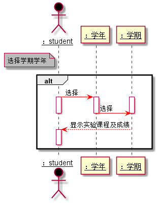

# “个人成绩中心”用例 [返回](../README.md)
## 1. 用例规约

|用例名称|个人成绩中心|
|-------|:-------------|
|功能|学生查看自己的某学年某学期的实验课程及其成绩|
|参与者|学生|
|前置条件|学生需要先登录|
|后置条件| |
|主事件流| 1.显示某学年某学期学生的实验课程及其成绩 2.学生可以通过点击查看详情查看具体的实验得分及其老师评语|
|备选事件流| |

## 2. 业务流程（顺序图） [源码](../src/个人成绩中心顺序图.puml)
 

## 3. 界面设计
- 界面参照: https://liuyi6161.github.io/is_analysis/test6/UI/personalscore2017-2018-2.html
- API接口调用
    - 接口1：[getOneStudentResults](../interface/getOneStudentResults.md) 

## 4. 算法描述
    无
    
## 5. 参照表
- [STUDENTS](../dataBaseDesign.md/#STUDENTS)
- [GRADES](../dataBaseDesign.md/#GRADES)
- [TESTS](../dataBaseDesign.md/#TESTS)
