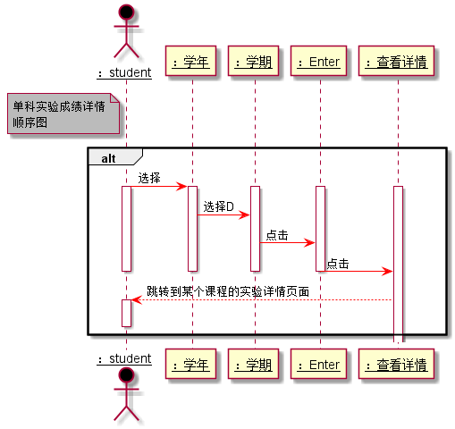

# “单科实验成绩详情”用例 [返回](../README.md)
## 1. 用例规约

|用例名称|单科实验成绩详情|
|-------|:-------------|
|功能|学生查看自己的每个实验的实验成绩及实验评价|
|参与者|学生|
|前置条件|学生需要先登录|
|后置条件| |
|主事件流| 学生查看查看某个实验的具体分值 分布和老师评语|
|备选事件流| |

## 2. 业务流程（顺序图） [源码](../src/单科实验成绩详情顺序图.puml)
 

## 3. 界面设计
- 界面参照: https://liuyi6161.github.io/is_analysis/test6/UI/infosystemscore.html
- API接口调用
    - 接口1：[getOneStudentResults](../interface/getOneStudentResults.md) 

## 4. 算法描述
    无
    
## 5. 参照表
- [STUDENTS](../dataBaseDesign.md/#STUDENTS)
- [GRADES](../dataBaseDesign.md/#GRADES)
- [TESTS](../dataBaseDesign.md/#TESTS)
