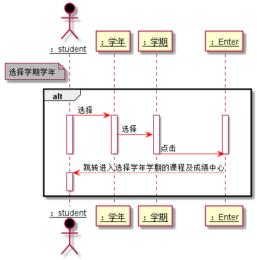

# “选择学期学年”用例 [返回](../README.md)
## 1. 用例规约

|用例名称|选择学期学年|
|-------|:-------------|
|功能|学生通过选择学期学年已达到查看某学年某学期的课程及其实验成绩|
|参与者|学生|
|前置条件|学生需要先登录|
|后置条件| |
|主事件流| 1.学生首先选择学年 2.学生选择学期 3.学生点击Enter键|
|备选事件流| |

## 2. 业务流程（顺序图） [源码](../src/选择学期学年.puml)
 

## 3. 界面设计
- 界面参照: https://liuyi6161.github.io/is_analysis/test6/UI/personalscore.html
- API接口调用
    无

## 4. 算法描述
    无
    
## 5. 参照表
- [TERM](../dataBaseDesign.md/#TERM)
- [COURSES_TERMES](../dataBaseDesign.md/#COURSES_TERMES)
- [TESTS](../dataBaseDesign.md/#TESTS)
